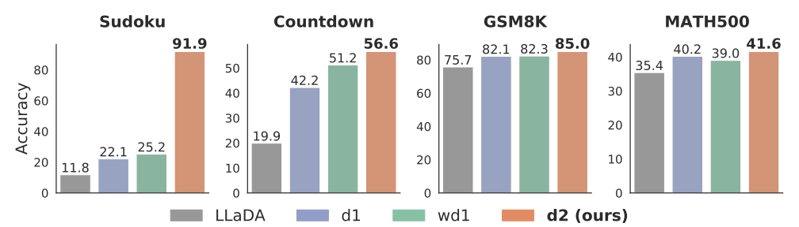

<div  align="center">
    <h1>d2: Improved Techniques for Training Reasoning Diffusion Language Models</h1>
</div>

[](https://arxiv.org/abs/2509.21474)
[](https://guanghanwang.com/d2)

This repo is the official implementation of the paper *d2: Improved Techniques for Training Reasoning Diffusion Language Models*.



<div align="center">
  <hr width="100%">
</div>

## Code Organization

In this repo, we provide the code of finetuning any-order causal LLaDA, d2-AnyOrder and diffu-GRPO RL post-training for causal LLaDA, and d2-StepMerge and diffu-GRPO RL post-training for standard LLaDA. The code is 
organized in this structure:

1. `dataset`: data files
2. `diffu-grpo`: code for standard LLaDA RL, including d2-StepMerge and diffu-GRPO
3. `diffu-grpo-ao`: code for any-order causal LLaDA RL, including d2-AnyOrder and diffu-GRPO
4. `eval`: evaluation code
5. `SFT_AO`: code for finetuning any-order causal LLaDA

## Environment Setup

To setup the environment, run:
```
conda env create -f env.yml
conda activate d2
pip install datasets==4.2.0
pip install jsonlines # used in any-order finetuning
```

## Checkpoints
We provide our finetuned any-order causal LLaDA checkpoints on Hugging Face, including any-order causal LLaDA checkpoint after the first finetuning stage: `GuanghanWang/d2_anyorder_causal_llada_intellectsft`, and the any-order causal LLaDA checkpoint
after two rounds of finetuning with the second round on GSM8K: `GuanghanWang/d2_anyorder_causal_llada_intellectsft_gsm8k`.

## Any-Order Finetuning
We provide the code for any-order causal fine-tuning to ensure maximal transparency. For the d2-AnyOrder RL experiments, you can also use our released any-order causal LLaDA checkpoint on GSM8K and jump to the `d2-AnyOrder` section. 

Here, we provide the data and code for the second finetuning phase. That is, take the checkpoint finetuned on 150k LLaDA-2.0-mini generated sequenced from 150k IntellectSFT prompts, and further finetune it on the LLaDA-2.0-mini generated sequences from GSM8K/MATH500 prompts. You can also do any-order finetuning on the model using your own data.

- Example bash scripts for any-order causal finetuning
  - GSM8K
  ```bash
  cd SFT_AO
  bash ./bash_scripts/finetune_gsm8k.sh > ./logs/finetune_gsm8k.log 2>&1
  ```
  - MATH500
  ```bash
  cd SFT_AO
  bash ./bash_scripts/finetune_math500.sh > ./logs/finetune_math500.log 2>&1
  ```

## d2-AnyOrder
The code for d2-AnyOrder and the correponding diffu-GRPO experiments is inside the `diffu-grpo-ao` directory. We provide RL code applied to our finetuned any-order
causal GSM8K checkpoint.

- `diffu-grpo-ao/bash_scripts` contains the bash scripts we used to run the RL experiments.
- Example bash scripts for running the RL experiments:
  - diffu-GRPO
  ```bash
  cd diffu-grpo-ao
  bash ./bash_scripts/anyorder_gsm8k_diffugrpo.sh > ./logs/anyorder_gsm8k_diffugrpo.log 2>&1
  ```
  - d2-AnyOrder
  ```bash
  cd diffu-grpo-ao
  bash ./bash_scripts/anyorder_gsm8k_d2anyorder.sh > ./logs/anyorder_gsm8k_d2anyorder.log 2>&1
  ```


## d2-StepMerge

The code for d2-StepMerge and the correponding diffu-GRPO experiments is inside the `diffu-grpo` directory.

- `diffu-grpo/bash_scripts` contains the bash scripts we used to run the RL experiments.
- Example bash scripts for running the RL experiments (change DATASET into the corresponding dataset name):
  - diffu-GRPO
  ```bash
  cd diffu-grpo
  bash ./bash_scripts/DATASET_diffugrpo.sh > ./logs/DATASET_diffugrpo.log 2>&1
  ```
  - d2-StepMerge
  ```bash
  cd diffu-grpo
  bash ./bash_scripts/DATASET_d2stepmerge.sh > ./logs/DATASET_d2stepmerge.log 2>&1
  ```


## Evaluation

The code for evaluation is inside the `eval` directory.

- `eval/bash_scripts` contains the bash scripts we use to run the evaluation.
- Example bash scripts for running the evaluation for the post-trained any-order causal LLaDA. Here, we conduct d2-AnyOrder RL on our provided
  any-order causal LLaDA checkpoint trained on GSM8K.
  - any-order causal LLaDA
  ```bash
  cd eval
  bash ./bash_scripts/eval_anyorder_gsm8k_llada.sh > ./logs/eval_anyorder_gsm8k_llada.log 2>&1
  ```
  - diffu-GRPO
  ```bash
  cd eval
  bash ./bash_scripts/eval_anyorder_gsm8k_diffugrpo.sh > ./logs/eval_anyorder_gsm8k_diffugrpo.log 2>&1
  ```
  - d2-AnyOrder
  ```bash
  cd eval
  bash ./bash_scripts/eval_anyorder_gsm8k_d2anyorder.sh > ./logs/eval_anyorder_gsm8k_d2anyorder.log 2>&1
  ```
- Example bash scripts for running the evaluation for the LLaDA-8B-Instruct experiments (change DATASET into the corresponding dataset name):
  - LLaDA-8B-Instruct
  ```bash
  cd eval
  bash ./bash_scripts/eval_DATASET_llada.sh > ./logs/eval_DATASET_llada.log 2>&1
  ```
  - diffu-GRPO
  ```bash
  cd diffu-grpo
  bash ./bash_scripts/eval_DATASET_diffugrpo.sh > ./logs/eval_DATASET_diffugrpo.log 2>&1
  ```
  - d2-StepMerge
  ```bash
  cd diffu-grpo
  bash ./bash_scripts/eval_DATASET_d2stepmerge.sh > ./logs/eval_DATASET_d2stepmerge.log 2>&1
  ```
- After generating samples using the bash scripts, run `parse_and_get_acc.py` to parse the json files and get the accuracy number. Remember to change the value of `directory` in the `parse_and_get_acc.py` script.

## Acknowledgements

This repository is built off of [d1](https://github.com/dllm-reasoning/d1).

## Citation

If you find this work useful, please consider citing:

```bibtex
@article{wang2025d2,
  title={d2: Improved techniques for training reasoning diffusion language models},
  author={Wang, Guanghan and Turok, Gilad and Schiff, Yair and Arriola, Marianne and Kuleshov, Volodymyr},
  journal={arXiv preprint arXiv:2509.21474},
  year={2025}
}
```

